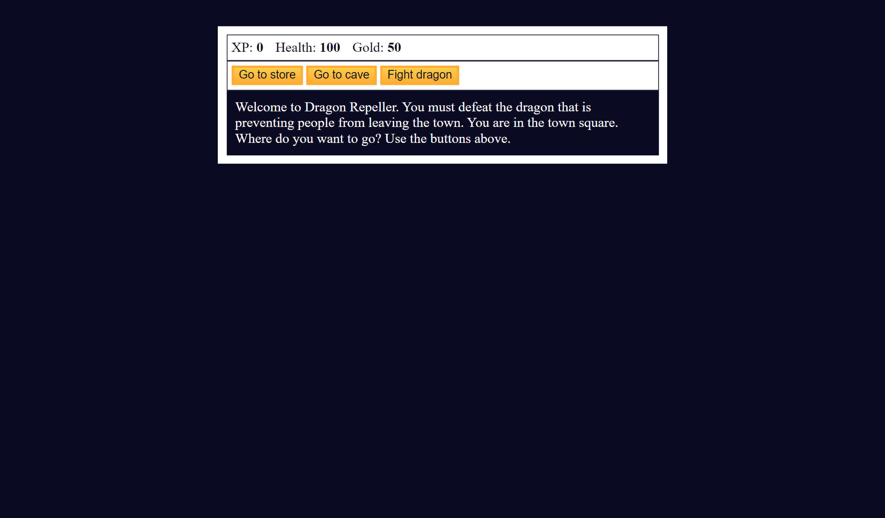

# Dragon Repeller

Embark on a thrilling adventure in this text-based RPG! Begin your journey with humble beginnings, armed with only a stick. Explore different locations like the town square, store, and cave, where you can buy health, upgrade your weapons, and battle monsters like slimes, fanged beasts, and even dragons! Use strategy and quick thinking to defeat your foes, gain experience points, and collect gold. But beware, one wrong move could lead to defeat! Will you emerge victorious and claim victory over the dragon, or will you meet a grim fate in this challenging RPG?

This is a freeCodeCamp practice project.

## Table of Contents

- [Screenshots](#screenshots)
- [Deployment](#deployment)
- [Usage](#usage)
- [Questions](#questions)

## Screenshots

## Deployment

[Dragon Repeller](https://zolotavina.github.io/dragon-repeller/)

## Usage

Click on the [link](https://zolotavina.github.io/dragon-repeller/) to access Dragon Repeller game.

## Questions

Open an issue if you have any questions about the repo. You can find more of my work [here](https://github.com/zolotavina).
